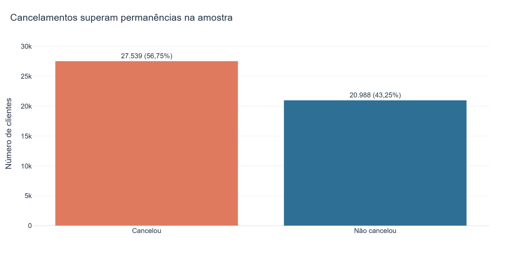
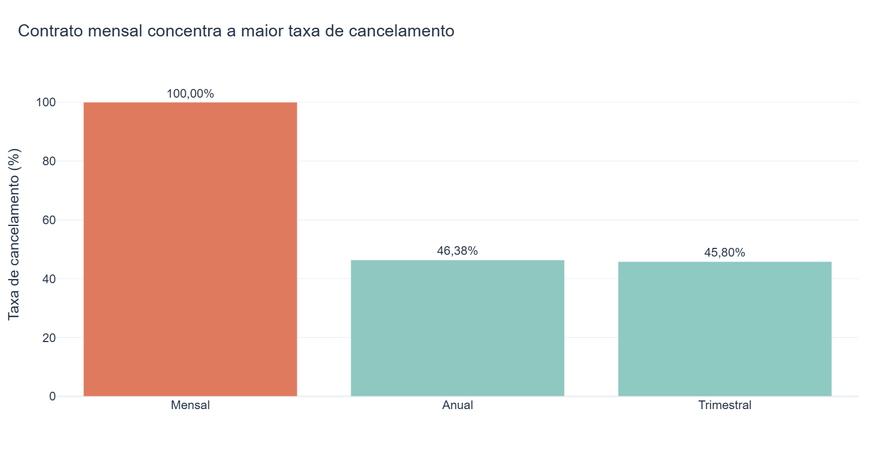
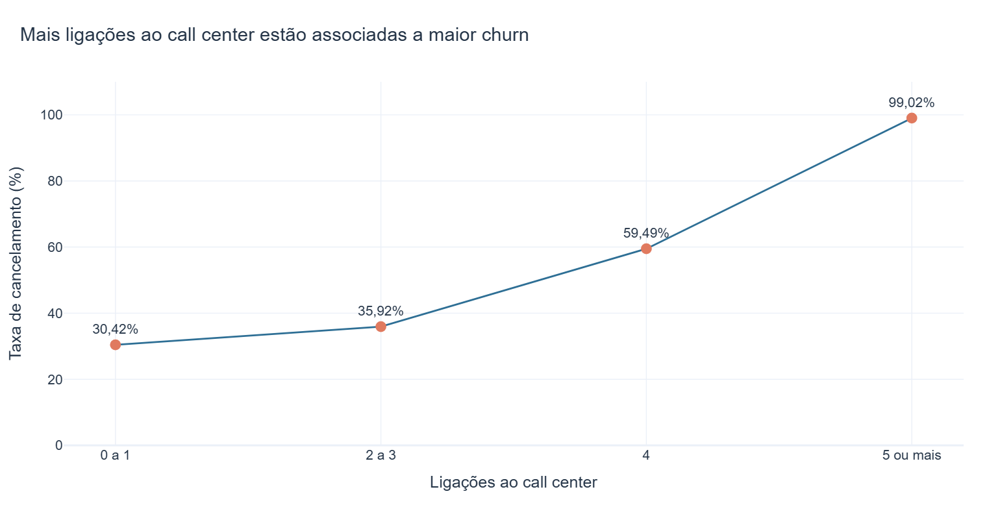
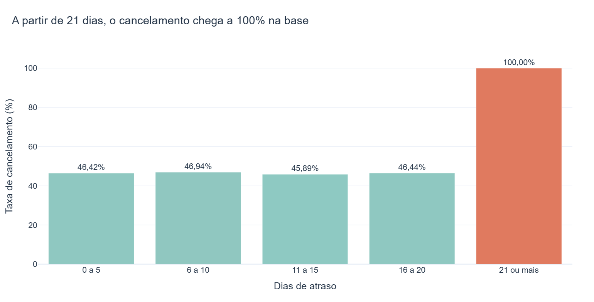
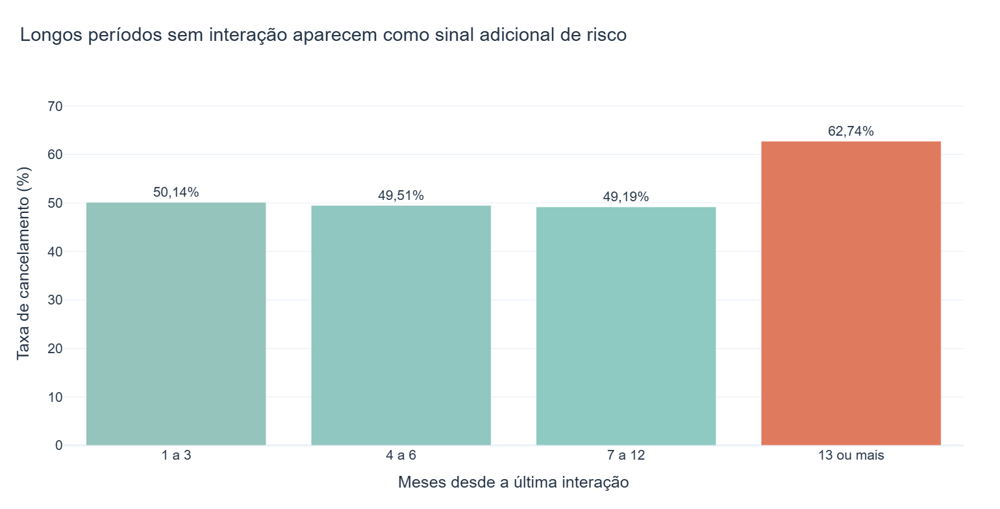

# Análise de cancelamento de clientes

Estudo exploratório em Python para identificar características **associadas** ao cancelamento de clientes e transformar os resultados em hipóteses e ações que poderiam ser testadas por uma empresa.

O projeto foi reorganizado para ser reproduzível, documentar a qualidade dos dados e evitar tratar correlação como causalidade.



## Resumo executivo

Após remover 1.469 linhas exatamente duplicadas e quatro registros incompletos, a análise utiliza **48.527 clientes**.

| Resultado | Valor observado |
|---|---:|
| Taxa geral de cancelamento | 56,75% |
| Clientes com contrato mensal que cancelaram | 100,00% |
| Churn entre clientes com 5 ou mais ligações | 99,02% |
| Churn entre clientes com 21 ou mais dias de atraso | 100,00% |
| Churn após mais de 12 meses sem interação | 62,74% |

Esses resultados descrevem a base educacional. Eles não comprovam que contrato, ligações ou atraso **causam** o cancelamento.

## Perguntas respondidas

1. Qual é a taxa geral de cancelamento?
2. Como a taxa varia conforme a duração do contrato?
3. Existe associação entre contatos com o call center e churn?
4. Como o atraso no pagamento se relaciona com o cancelamento?
5. A ausência de interação recente aparece como sinal de risco?

## Principais resultados

### Duração do contrato

Todos os 9.595 clientes com contrato mensal aparecem como cancelados. Contratos anuais e trimestrais apresentam taxas próximas de 46%.



### Ligações ao call center

A taxa aumenta conforme cresce o número de ligações. Clientes com cinco ou mais contatos apresentam churn de 99,02%.



### Dias de atraso

Até 20 dias de atraso, a taxa fica próxima de 46%. A partir de 21 dias, todos os 9.356 clientes da faixa aparecem como cancelados.



### Tempo sem interação

Clientes com mais de 12 meses desde a última interação apresentam churn de 62,74%, acima das faixas mais recentes.



## Recomendações para teste

- Avaliar incentivos para migração do contrato mensal para contratos mais longos.
- Criar alerta após o terceiro contato com o call center e tratar reincidências.
- Antecipar cobrança e negociação antes do vigésimo dia de atraso.
- Acionar campanhas de reengajamento antes de 12 meses sem interação.

Essas ações são hipóteses. Uma empresa real deveria validá-las com acompanhamento temporal ou testes controlados.

## Cenário descritivo

O subconjunto sem contrato mensal, com até quatro ligações e até 20 dias de atraso representa 52,63% da amostra e possui churn de 18,42%.

Esse número **não é uma previsão** de que a aplicação das recomendações reduziria o churn para 18,42%. Ele apenas compara grupos já existentes na base.

## Qualidade e origem dos dados

O arquivo original possui 50.000 linhas e 12 colunas. Foram identificados:

- 1.469 registros exatamente duplicados;
- quatro linhas com pelo menos um valor ausente;
- IDs repetidos nas mesmas linhas duplicadas;
- padrões de 100% em algumas faixas, compatíveis com uma base sintética ou construída para ensino.

O notebook original indicava uma pasta de materiais do projeto educacional **Python Insights** como origem. O endereço não pôde ser consultado automaticamente durante a revisão. O projeto não afirma que os registros representam clientes reais e não atribui uma licença própria ao conjunto de dados. Consulte [a documentação da base](data/README.md).

## Tecnologias

- Python
- Pandas
- Plotly Express
- Jupyter Notebook
- Kaleido para exportação das imagens

## Estrutura

```text
analise-de-cancelamento/
|-- data/
|   |-- cancelamentos.csv
|   `-- README.md
|-- imagens/
|   |-- taxa-geral.png
|   |-- churn-por-contrato.png
|   |-- churn-por-callcenter.png
|   |-- churn-por-atraso.png
|   `-- churn-por-interacao.png
|-- notebooks/
|   `-- analise_cancelamento.ipynb
|-- .gitignore
|-- README.md
`-- requirements.txt
```

## Como executar

### 1. Criar o ambiente virtual

No Windows PowerShell:

```powershell
python -m venv .venv
.venv\Scripts\Activate.ps1
```

No Linux ou macOS:

```bash
python3 -m venv .venv
source .venv/bin/activate
```

### 2. Instalar as dependências

```bash
python -m pip install -r requirements.txt
```

### 3. Abrir o notebook

Abra `notebooks/analise_cancelamento.ipynb` no VS Code com a extensão Jupyter e selecione o ambiente virtual criado.

Quem preferir JupyterLab pode instalar a interface e iniciar o projeto:

```bash
python -m pip install jupyterlab
jupyter lab
```

Execute todas as células em ordem. O notebook localiza a pasta do projeto e recria as imagens em `imagens/`.

## Limitações

- A origem empresarial, o período de coleta e a licença dos dados não estão documentados.
- A base parece educacional e pode ter padrões artificiais.
- A análise é descritiva e não controla confundidores.
- Não existe acompanhamento temporal de clientes.
- Nenhuma recomendação foi testada experimentalmente.

## Próximos passos em um caso real

- Confirmar procedência, período e definição de churn.
- Analisar coortes ao longo do tempo.
- Incluir custos e valor do cliente.
- Testar campanhas com grupos de controle.
- Medir retenção antes de atribuir impacto às ações.

## Autor

Desenvolvido por **Pedro Henrique Lima** como projeto de portfólio e estudo de análise de dados.
